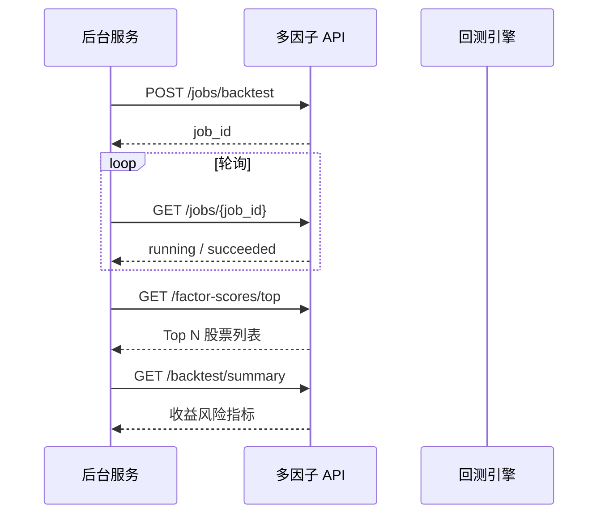

# 多因子回测服务 — 接口文档与使用说明

版本：v1.0.0  
基础路径：`http://<host>:<port>/api/v1`  
默认端口：`8000`

---

## 目录

1. [服务概述](#1-服务概述)
2. [环境与部署](#2-环境与部署)
3. [鉴权说明](#3-鉴权说明)
4. [统一响应格式](#4-统一响应格式)
5. [接口列表](#5-接口列表)
6. [接口详情](#6-接口详情)
7. [典型使用流程](#7-典型使用流程)
8. [命令行方式（CLI）](#8-命令行方式cli)
9. [错误与排查](#9-错误与排查)
10. [附录](#10-附录)

---

## 1. 服务概述

本服务将 **米筐 RQDatac + RQFactor + RQAlpha**（或 **同花顺 iFinD 本地表**）多因子选股回测能力，封装为 **REST JSON HTTP API**，供其他后台系统调用。

### 能力边界

| 能力 | 说明 |
|------|------|
| 因子得分 | PE / PB / ROE / 动量加权合成，截面排名得分 |
| 选股列表 | 指定交易日 Top N 标的及得分 |
| 因子检验 | IC 汇总（需先跑批生成 Excel） |
| 因子市场 | Blader `factor_base_info` + `factor_data_wide`：列表、详情、IC 走势、分组收益 |
| 组合回测 | 月度调仓、滑点、手续费、基准对比 |
| 异步任务 | 长耗时回测通过 `job_id` 轮询 |

### 架构示意

```
其他后台服务  --HTTP JSON-->  FastAPI (api/main.py)
                                  |
                                  v
                         multi_factor/service/runner.py
                                  |
              +-------------------+-------------------+
              |                   |                   |
          RQDatac            iFinD 本地库         RQAlpha Bundle
         (license)          (SQL/CSV)            (撮合回测)
```

### 在线文档

服务启动后访问：

- Swagger UI：`http://127.0.0.1:8000/docs`
- OpenAPI JSON：`http://127.0.0.1:8000/openapi.json`

---

## 2. 环境与部署

### 2.1 依赖安装

```bash
cd stock_algorithm
pip install -r requirements.txt
```

主要依赖：`rqalpha`、`rqfactor`、`rqdatac`、`fastapi`、`uvicorn`、`pandas`。

### 2.2 数据前置条件

| 数据源 `source` | 前置条件 |
|-----------------|----------|
| `rqdatac`（默认） | 已配置 RQData License（用户环境变量 `RQDATAC2_CONF` 或 `rqdatac.init('license', key)`） |
| `ifind` | 已配置 `config/ifind_config.yaml`，并完成 iFinD 表同步 |
| `demo` | 已执行 `rqalpha download-bundle --confirm` |

`rqdatac` 路径下 **读取类接口** 依赖已生成的 `output/factor_scores.pkl`；**回测类接口** 依赖 `output/backtest_report/` 下 CSV/JSON。

### 2.3 启动服务

```bash
# 方式一
python run_api.py

# 方式二
uvicorn api.main:app --host 0.0.0.0 --port 8000
```

### 2.4 环境变量

| 变量名 | 默认值 | 说明 |
|--------|--------|------|
| `API_HOST` | `0.0.0.0` | 监听地址 |
| `API_PORT` | `8000` | 监听端口 |
| `API_RELOAD` | 空 | 设为 `true` 开启热重载（开发用） |
| `MULTI_FACTOR_API_KEY` | 空 | 非空时启用 `X-API-Key` 鉴权 |
| `API_CORS_ORIGINS` | `*` | 允许跨域来源，逗号分隔 |
| `RQDATAC2_CONF` | — | 米筐 License URI（Windows 用户级环境变量亦可） |

### 2.5 生产部署建议

- 使用 **gunicorn + uvicorn worker** 或 systemd 守护 `run_api.py`。
- 设置 `MULTI_FACTOR_API_KEY`，网关层增加 IP 白名单。
- 长回测一律走 **异步任务** `POST /jobs/backtest`，避免 HTTP 超时。
- 多实例部署时，异步任务为 **进程内内存队列**，任务状态不跨实例共享；生产可后续改为 Redis 队列。

---

## 3. 鉴权说明

未设置 `MULTI_FACTOR_API_KEY` 时：**无需鉴权**。

设置后，所有 `/api/v1/*` 请求须携带请求头：

```http
X-API-Key: <你的密钥>
```

失败响应：

```http
HTTP/1.1 401 Unauthorized
```

```json
{"detail": "Invalid or missing X-API-Key"}
```

---

## 4. 统一响应格式

### 4.1 成功响应

```json
{
  "code": 0,
  "message": "ok",
  "data": { }
}
```

| 字段 | 类型 | 说明 |
|------|------|------|
| `code` | int | `0` 表示业务成功 |
| `message` | string | 提示信息 |
| `data` | object / array / null | 业务数据 |

### 4.2 HTTP 状态码

| HTTP | 含义 |
|------|------|
| 200 | 成功（业务错误也可能包在 body 内，读取接口以 200 + 文件是否存在为准） |
| 401 | 鉴权失败 |
| 404 | 资源不存在（如 `job_id`、因子分析文件） |
| 422 | 请求参数校验失败（FastAPI） |
| 500 | 服务内部未捕获异常 |

### 4.3 业务异常（200 之外）

读取接口在数据文件缺失时，服务端抛出异常，通常返回 **500**，body 含错误堆栈或 `detail` 文本。调用方应先调 `/health` 检查 `factor_scores_ready`、`backtest_report_ready`。

---

## 5. 接口列表

| 分类 | 方法 | 路径 | 说明 |
|------|------|------|------|
| 系统 | GET | `/health` | 健康检查、RQDatac 状态 |
| 因子 | GET | `/factor-scores` | 因子得分矩阵 |
| 因子 | GET | `/factor-scores/top` | 某日 Top N 股票 |
| 因子 | GET | `/factor-analysis/{factor_name}/ic` | 单因子 IC 汇总（RQFactor 批跑 Excel） |
| 因子市场 | GET | `/factors` | iFinD 因子列表 + IC 均值 / 夏普 |
| 因子市场 | GET | `/factors/detail` | 单因子完整绩效报告（`factor_code` 用 Query） |
| 因子市场 | GET | `/factors/summary` | 元数据 + 汇总指标（`factor_code` 用 Query） |
| 因子市场 | GET | `/factors/ic-trend` | IC 走势序列（`factor_code` 用 Query） |
| 因子市场 | GET | `/factors/group-returns` | Top/Bottom 分组收益与净值（`factor_code` 用 Query） |
| 因子市场 | GET | `/factors/raw-values` | `factor_calc_data` 原始截面（`factor_code` 用 Query） |
| 因子市场 | POST | `/factors/performance/warmup` | 提交因子绩效离线预热任务（写入 `factor_performance_*`） |
| **多因子引擎** | POST | `/engine/backtest/run-sync` | 同步执行引擎回测（推荐） |
| **多因子引擎** | POST | `/engine/jobs/backtest` | 异步引擎回测 |
| **多因子引擎** | GET | `/engine/backtest/performance` | 绩效指标 |
| **多因子引擎** | GET | `/engine/backtest/summary` | 完整 summary.json |
| **多因子引擎** | GET | `/engine/backtest/portfolio` | 净值序列 |
| **多因子引擎** | GET | `/engine/backtest/trades` | 成交明细 |
| **多因子引擎** | GET | `/engine/backtest/positions` | 持仓明细 |
| **多因子引擎** | GET | `/engine/composite-scores` | 合成因子得分 |
| **多因子引擎** | GET | `/engine/factor-analysis/{factor_code}` | 单因子分析 JSON |
| **多因子引擎** | GET | `/engine/charts` | 图表文件列表 |
| **多因子引擎** | GET | `/engine/charts/{path}` | 下载 PNG 图表 |
| 回测 | GET | `/backtest/summary` | 最近一次回测指标 |
| 回测 | GET | `/backtest/portfolio` | 组合净值序列 |
| 回测 | GET | `/backtest/trades` | 成交明细 |
| 任务 | POST | `/jobs/backtest` | 提交异步回测（`use_engine=true` 走引擎） |
| 任务 | GET | `/jobs/{job_id}` | 查询任务状态与结果 |
| 回测 | POST | `/backtest/run-sync` | 同步执行回测（调试用） |

---

## 6. 接口详情

### 6.1 健康检查

**GET** `/api/v1/health`

**响应示例**

```json
{
  "code": 0,
  "message": "ok",
  "data": {
    "status": "ok",
    "rqdatac": {
      "connected": true,
      "detail": {
        "license_type": "TRIAL",
        "remaining_days": 14
      }
    },
    "factor_scores_ready": true,
    "backtest_report_ready": true
  }
}
```

| 字段 | 说明 |
|------|------|
| `rqdatac.connected` | 能否连接米筐数据服务 |
| `factor_scores_ready` | `output/factor_scores.pkl` 是否存在 |
| `backtest_report_ready` | 传统回测报告是否存在 |
| `engine_report_ready` | `output/engine_report/summary.json` 是否存在 |

---

### 6.2 因子得分矩阵

**GET** `/api/v1/factor-scores`

**Query 参数**

| 参数 | 必填 | 说明 |
|------|------|------|
| `date` | 否 | 单日截面，格式 `YYYY-MM-DD`；非交易日自动取最近前一交易日 |
| `start` | 否 | 区间起始日期 `YYYY-MM-DD` |
| `end` | 否 | 区间结束日期 `YYYY-MM-DD` |
| `symbols` | 否 | 逗号分隔股票代码，如 `600000.XSHG,000001.XSHE` |
| `format` | 否 | `records`（默认）或 `split` |

**format=records 时 data 结构**

```json
{
  "records": [
    {"index": "2023-01-03", "600000.XSHG": 0.65, "000001.XSHE": 0.42}
  ],
  "meta": {
    "rows": 242,
    "cols": 300,
    "start": "2023-01-03",
    "end": "2023-12-29"
  }
}
```

**format=split 时 data 结构**（适合矩阵/热力图）

```json
{
  "dates": ["2023-01-03", "2023-01-04"],
  "symbols": ["600000.XSHG", "000001.XSHE"],
  "values": [
    [0.65, 0.42],
    [0.66, 0.41]
  ],
  "meta": { "rows": 2, "cols": 2, "start": "2023-01-03", "end": "2023-01-04" }
}
```

> 得分越大表示合成因子排名越靠前（越值得买入）。缺失值为 `null`。

**curl 示例**

```bash
curl "http://127.0.0.1:8000/api/v1/factor-scores?date=2023-12-01&format=records"
```

---

### 6.3 某日 Top N 选股

**GET** `/api/v1/factor-scores/top`

**Query 参数**

| 参数 | 必填 | 说明 |
|------|------|------|
| `date` | 是 | 调仓/截面日 `YYYY-MM-DD` |
| `top_n` | 否 | 默认 `30`，范围 1–200 |

**响应示例**

```json
{
  "code": 0,
  "message": "ok",
  "data": {
    "date": "2023-12-01",
    "top_n": 5,
    "stocks": [
      {"order_book_id": "601919.XSHG", "score": 0.2967},
      {"order_book_id": "600089.XSHG", "score": 0.2967}
    ]
  }
}
```

**适用场景**：下游交易系统每月调仓日拉取目标持仓列表。

---

### 6.4 因子 IC 汇总

**GET** `/api/v1/factor-analysis/{factor_name}/ic`

**路径参数**

| 参数 | 取值 |
|------|------|
| `factor_name` | `pe` / `pb` / `roe` / `momentum` / `composite` |

**前置条件**：已执行带因子检验的回测任务，且存在  
`output/factor_analysis/{factor_name}/factor_analysis.xlsx`。

**响应示例**

```json
{
  "code": 0,
  "message": "ok",
  "data": {
    "factor": "momentum",
    "ic_summary": [
      {"Unnamed: 0": "mean", "P_1": 0.0197, "P_5": 0.0296, "P_20": 0.0452}
    ]
  }
}
```

---

### 6.5 回测摘要

**GET** `/api/v1/backtest/summary`

返回 **最近一次** 回测任务写入的 `summary.json` 指标。

**响应示例（节选）**

```json
{
  "code": 0,
  "message": "ok",
  "data": {
    "summary": {
      "start_date": "2023-01-03",
      "end_date": "2023-12-29",
      "total_returns": 0.06,
      "annualized_returns": 0.0625,
      "benchmark_total_returns": -0.1138,
      "sharpe": 0.3352,
      "max_drawdown": 0.1315,
      "alpha": 0.1358,
      "beta": 0.6769,
      "information_ratio": 1.142
    }
  }
}
```

**主要字段说明**

| 字段 | 说明 |
|------|------|
| `total_returns` | 策略总收益率 |
| `annualized_returns` | 年化收益率 |
| `benchmark_total_returns` | 基准（沪深300）总收益 |
| `sharpe` | 夏普比率 |
| `max_drawdown` | 最大回撤 |
| `alpha` / `beta` | 相对基准 |
| `information_ratio` | 信息比率 |

---

### 6.6 组合净值序列

**GET** `/api/v1/backtest/portfolio`

| 参数 | 说明 |
|------|------|
| `limit` | 可选，返回最近 N 条 |

**响应**：`data.records` 为行数组，含 `date`、`unit_net_value`、`total_value` 等列（与 `portfolio.csv` 一致）。

---

### 6.7 成交明细

**GET** `/api/v1/backtest/trades`

| 参数 | 说明 |
|------|------|
| `limit` | 可选，返回最近 N 条 |

**响应**：`data.records` 与 `trades.csv` 字段一致。

---

### 6.8 提交异步回测任务（推荐）

**POST** `/api/v1/jobs/backtest`  
**Content-Type**：`application/json`

**请求体**

```json
{
  "source": "rqdatac",
  "start": "20230101",
  "end": "20231229",
  "index": "000300.XSHG",
  "top_n": 30,
  "skip_factor_analysis": false,
  "skip_backtest": false,
  "scores_only": false,
  "ifind_config": null,
  "local_backtest": true,
  "factor_weights": {
    "pe": 0.25,
    "pb": 0.25,
    "roe": 0.25,
    "momentum": 0.25
  }
}
```

**字段说明**

| 字段 | 类型 | 默认 | 说明 |
|------|------|------|------|
| `source` | string | `rqdatac` | `rqdatac` / `ifind` / `demo` |
| `start` | string | 必填 | 开始日期 `YYYYMMDD` |
| `end` | string | 必填 | 结束日期 `YYYYMMDD` |
| `index` | string | `000300.XSHG` | 股票池指数（rqdatac） |
| `top_n` | int | 30 | 持仓只数 |
| `skip_factor_analysis` | bool | false | 跳过 IC/分层检验（可显著提速） |
| `skip_backtest` | bool | false | 仅算因子得分，不回测 |
| `scores_only` | bool | false | 同跳过回测 |
| `ifind_config` | string | null | iFinD 配置文件路径 |
| `local_backtest` | bool | true | `ifind` 时用本地撮合；false 则用 RQAlpha Bundle |
| `factor_weights` | object | null | 不传则用内置等权 |

**响应示例**

```json
{
  "code": 0,
  "message": "job submitted",
  "data": {
    "job_id": "a1b2c3d4e5f6789012345678abcdef01"
  }
}
```

---

### 6.9 查询异步任务

**GET** `/api/v1/jobs/{job_id}`

**任务状态 `status`**

| 值 | 说明 |
|----|------|
| `pending` | 已创建，等待执行 |
| `running` | 执行中 |
| `succeeded` | 成功，`result` 有值 |
| `failed` | 失败，`error` 为堆栈文本 |

**成功时 result 示例**

```json
{
  "summary": { "total_returns": 0.06, "...": "..." },
  "factor_scores_shape": [242, 300],
  "output_dir": "D:\\PythonProject\\stock_algorithm\\output",
  "message": "ok"
}
```

**轮询建议**：间隔 5–30 秒；全市场多年回测可能需 10–60 分钟。

---

### 6.10 同步回测（调试）

**POST** `/api/v1/backtest/run-sync`  
请求体与 [6.8](#68-提交异步回测任务推荐) 相同。

HTTP 连接将一直阻塞至任务结束，**仅建议短区间**（如 1–3 个月）或 `skip_factor_analysis: true`。

---

### 6.11 因子市场（Blader / iFinD）

数据来源：

- 元数据：`blader.factor_base_info`（`factor_code`、`factor_name`、`factor_type`、`factor_desc`、`sort_type` 等）
- 计算值：`blader.factor_data_wide`（`stock_code`、`data_date`、各因子列 / `factor_ext_json`）

需在 `config/ifind_config.yaml` 中配置 Blader 连接及 `tables.factor_base`、`tables.factor`。  
稀疏基本面因子会先 **按交易日 forward-fill** 再计算 IC / 分组收益（与本地回测 `align_to_trading_days` 一致）。

**公共 Query 参数**

| 参数 | 必填 | 说明 |
|------|------|------|
| `start` | 否 | 分析区间起 `YYYYMMDD` 或 `YYYY-MM-DD`；缺省为行情表最小日 |
| `end` | 否 | 分析区间止；缺省为行情表最大日 |
| `period` | 否 | IC / 分组收益前瞻持有期（交易日），默认 `1` |
| `quantiles` | 否 | 分层组数，默认 `5` |
| `top_pct` | 否 | Top/Bottom 比例，默认 `0.2` |
| `prefer_db` | 否 | 默认 `true`，优先读 `factor_performance_*` |
| `persist_on_compute` | 否 | 默认 `false`；为 `true` 时若走实时计算会写回 `factor_performance_*` |
| `ifind_config` | 否 | 自定义 ifind 配置文件路径 |

#### 6.11.1 因子列表

**GET** `/api/v1/factors`

返回每个有效因子的基础信息及汇总指标（用于「因子市场」列表页）。

**响应 data 示例（数组元素）**

```json
{
  "factor_code": "PE_TTM",
  "factor_name": "市盈率TTM",
  "factor_type": "基本面",
  "factor_desc": "...",
  "sort_type": "asc",
  "ic_mean": -0.017,
  "ic_win_rate": 0.36,
  "sharpe_ratio": -2.8,
  "data_start": "2025-11-10",
  "data_end": "2026-05-29"
}
```

`sharpe_ratio` 为 Top/Bottom 多空组合夏普；计算失败时含 `error` 字段。

#### 6.11.2 因子详情（完整报告）

**GET** `/api/v1/factors/detail`

**额外参数**：`quantiles`（默认 5）、`top_pct`（默认 0.2，Top/Bottom 各 20%）

**响应 data 结构**

| 字段 | 说明 |
|------|------|
| `meta` | `factor_base_info` 元数据 |
| `summary` | `ic_mean`、`win_rate`、`ic_ir`、多空夏普、`data_start` / `data_end` |
| `ic_trend` | `[{date, ic}, ...]` |
| `group_returns` | `[{date, top_group, bottom_group, top_group_nav, bottom_group_nav}, ...]` |
| `quantile_returns` | 分位组 `q1..qN` 收益与净值 |

`factor_code` 示例：`PE_TTM`、`PB_MRQ`、`ROE_TTM`、`MARKET_VALUE` 等（与库中 `factor_code` 一致，大小写不敏感）。

#### 6.11.3 子资源

| 路径 | 说明 |
|------|------|
| `GET /factors/summary?factor_code=...` | `meta` + `summary` + `data_source` |
| `GET /factors/ic-trend?factor_code=...` | IC 序列 + `ic_mean` / `win_rate` |
| `GET /factors/group-returns?factor_code=...` | 分组收益曲线数据 |
| `GET /factors/raw-values?factor_code=...` | 原始因子宽表；`date` 单日截面；`format=split\|records` |

**curl 示例**

```bash
curl -H "X-API-Key: your-key" "http://127.0.0.1:8000/api/v1/factors?start=20251110&end=20260530"
curl "http://127.0.0.1:8000/api/v1/factors/detail?factor_code=PE_TTM&period=1"
curl "http://127.0.0.1:8000/api/v1/factors/ic-trend?factor_code=PE_TTM&period=1"
curl "http://127.0.0.1:8000/api/v1/factors/summary?factor_code=PE_TTM&prefer_db=true"
```

> 因子市场读取策略：优先读 `factor_performance_summary` / `factor_performance_series`。  
> 当 `prefer_db=true` 且统计表无对应区间数据时，接口会**快速返回并自动提交预热任务**（返回 `warmup_job_id`），不会阻塞等待实时重算。  
> 服务端对单因子报告缓存 1 小时。
>
> `data_source` 字段说明：
> - `db`：来自 `factor_performance_*` 统计表
> - `db_miss`：统计表未命中，已触发离线预热任务
> - `compute`：实时计算
> - `compute+persist`：实时计算并已回填统计表

#### 6.11.4 因子绩效离线预热（推荐）

**POST** `/api/v1/factors/performance/warmup`

用于提前离线计算并写入 `factor_performance_summary` / `factor_performance_series`，避免查询时触发实时重算。

**请求体（JSON）**

```json
{
  "start": "20251110",
  "end": "20260530",
  "factor_code": "MOMENTUM_20",
  "period": 1,
  "quantiles": 5,
  "top_pct": 0.2
}
```

说明：

- 传 `factor_code`：单因子预热
- 传 `factor_codes`：批量因子预热
- 两者都不传：按 `factor_base_info` 全量预热

**响应示例**

```json
{
  "code": 0,
  "message": "job submitted",
  "data": {
    "job_id": "2bece3849d474bbd9db58f97a44e4339",
    "job_type": "factor_performance"
  }
}
```

**状态查询**

- `GET /api/v1/jobs/{job_id}`（`status` 为 `pending/running/succeeded/failed`）

#### 6.11.5 首次 DB miss 自动预热流程

1. 业务查询（例如）：
   - `GET /api/v1/factors/detail?factor_code=MOMENTUM_20&start=20251110&end=20260530&prefer_db=true&persist_on_compute=false`
2. 若 DB 未命中，接口快速返回：
   - `message = "db miss, warmup started"`
   - `data.warmup_job_id = <job_id>`
3. 轮询任务：
   - `GET /api/v1/jobs/{job_id}` 直至 `succeeded`
4. 再次查询同参数：
   - 命中 `factor_performance_*`，`data_source = db`

---

### 6.12 多因子引擎（推荐）

完整策略流水线见 [多因子引擎.md](./多因子引擎.md)。Swagger 标签：**多因子引擎**。

#### 6.12.1 同步回测

**POST** `/api/v1/engine/backtest/run-sync`

**请求体（JSON）**

```json
{
  "start": "20251110",
  "end": "20260530",
  "factors": [
    {"code": "PE_TTM", "weight": 0.25, "ascending": false},
    {"code": "PB", "weight": 0.25, "ascending": false},
    {"code": "ROE_TTM", "weight": 0.25, "ascending": true}
  ],
  "weight_mode": "equal",
  "universe": "all_a",
  "top_n": 30,
  "rebalance_freq": "daily",
  "cap_neutral": false,
  "buy_commission": 0.0003,
  "sell_commission": 0.0013,
  "slippage": 0.001
}
```

**响应 data**：`performance`、`output_dir`、`factor_scores_shape`、`factor_analyses`

#### 6.12.2 异步回测

**POST** `/api/v1/engine/jobs/backtest` — 请求体同上，返回 `job_id`  
**GET** `/api/v1/jobs/{job_id}` — 轮询状态

或通过传统任务接口：`POST /api/v1/jobs/backtest` 设置 `"source":"ifind", "use_engine": true`。

#### 6.12.3 读取报告

| 方法 | 路径 |
|------|------|
| GET | `/engine/backtest/performance` |
| GET | `/engine/backtest/summary` |
| GET | `/engine/backtest/portfolio` |
| GET | `/engine/backtest/trades` |
| GET | `/engine/backtest/positions` |
| GET | `/engine/composite-scores` |
| GET | `/engine/factor-analysis/{factor_code}` |
| GET | `/engine/charts` |
| GET | `/engine/charts/nav_vs_benchmark.png` |

**curl**

```bash
curl -X POST "http://127.0.0.1:8000/api/v1/engine/backtest/run-sync" \
  -H "Content-Type: application/json" \
  -d '{"start":"20251110","end":"20260530","top_n":20,"factors":[{"code":"PE_TTM"},{"code":"PB"}]}'

curl "http://127.0.0.1:8000/api/v1/engine/backtest/performance"
curl "http://127.0.0.1:8000/api/v1/engine/charts/nav_vs_benchmark.png" -o nav.png
```

---

## 7. 典型使用流程

### 7.1 下游每日选股（只读）

```
1. GET /health          → 确认 factor_scores_ready = true
2. GET /factor-scores/top?date=2024-01-02&top_n=30
3. 将 stocks[].order_book_id 送入交易系统
```

若 `factor_scores_ready = false`，需先由批处理触发 [7.2](#72-定期全量重算)。

### 7.2 定期全量重算

```
1. POST /jobs/backtest
   Body: {
     "source": "rqdatac",
     "start": "20200101",
     "end": "20241231",
     "top_n": 30,
     "skip_factor_analysis": true
   }
2. 轮询 GET /jobs/{job_id} 直至 status = succeeded
3. GET /backtest/summary、/factor-scores/top 消费结果
```

### 7.3 因子研究 + 回测一体

```
POST /jobs/backtest
{
  "source": "rqdatac",
  "start": "20200101",
  "end": "20231229",
  "skip_factor_analysis": false
}
完成后:
  GET /factor-analysis/momentum/ic
  GET /backtest/summary
```

### 7.4 iFinD / Blader 数据源与因子市场

已对接 **Blader MySQL**（`factor_base_info`、`factor_data_wide`、`stock_daily_qfq`），详见 [Blader数据源配置.md](./Blader数据源配置.md)。

```
1. 复制 config/ifind_config.blader.example.yaml → config/ifind_config.yaml
2. 填写 database 或设置 BLADER_DB_USER / BLADER_DB_PASSWORD
3. 因子市场（无需 RQDatac）:
   GET /factors?start=20251110&end=20260530
   GET /factors/detail?factor_code=PE_TTM
   GET /factors/ic-trend?factor_code=PE_TTM
   GET /factors/group-returns?factor_code=PE_TTM
4. CLI 回测:
   python run_backtest.py --source ifind --start 20251110 --end 20260530 --local-backtest
5. API 回测:
   POST /jobs/backtest
   { "source": "ifind", "start": "20251110", "end": "20260530", "local_backtest": true }
```

### 7.5 时序图（异步）



---

## 8. 命令行方式（CLI）

不经过 HTTP、直接在服务器跑批时：

```bash
# 米筐全链路
python run_backtest.py --source rqdatac --start 20230101 --end 20231229

# 仅得分 + 回测，跳过因子检验
python run_backtest.py --source rqdatac --start 20230101 --end 20231229 --skip-factor-analysis

# iFinD 本地表
python run_backtest.py --source ifind --start 20230101 --end 20231229

# 启动 API
python run_api.py
```

CLI 与 API 共用 `output/` 目录，**先 CLI 跑批、后 API 只读查询** 亦可。

---

## 9. 错误与排查

| 现象 | 可能原因 | 处理 |
|------|----------|------|
| `factor_scores_ready: false` | 未跑过回测 | `POST /jobs/backtest` 或 CLI |
| `rqdatac.connected: false` | License 未配置/过期 | 检查 `RQDATAC2_CONF` |
| 401 | 未带 `X-API-Key` | 配置请求头 |
| 404 job not found | job_id 错误或进程重启 | 任务存在内存，重启后丢失 |
| 404 factor analysis | 未跑因子检验 | `skip_factor_analysis: false` |
| 500 因子得分文件不存在 | 读接口早于写完成 | 等待任务 `succeeded` |
| 同步接口超时 | 区间过长 | 改异步任务 |

---

## 10. 附录

### 10.1 股票代码规范

- 米筐 / API 返回：`600000.XSHG`、`000001.XSHE`
- iFinD 表内可为 `600000.SH`，服务内部会自动转换

### 10.2 输出文件目录

| 路径 | 内容 |
|------|------|
| `output/factor_scores.pkl` | 合成因子得分宽表 |
| `output/backtest_report/summary.json` | 回测指标 |
| `output/backtest_report/portfolio.csv` | 每日净值 |
| `output/backtest_report/trades.csv` | 成交 |
| `output/factor_analysis/{因子}/factor_analysis.xlsx` | IC / 分层 |

### 10.3 Python 调用示例

```python
import time
import requests

BASE = "http://127.0.0.1:8000/api/v1"
HEADERS = {"X-API-Key": "your-key"}  # 可选

# 健康检查
r = requests.get(f"{BASE}/health", headers=HEADERS, timeout=10)
print(r.json())

# Top 股票
r = requests.get(
    f"{BASE}/factor-scores/top",
    params={"date": "2023-12-01", "top_n": 10},
    headers=HEADERS,
    timeout=30,
)
for s in r.json()["data"]["stocks"]:
    print(s["order_book_id"], s["score"])

# 异步回测
r = requests.post(
    f"{BASE}/jobs/backtest",
    json={
        "source": "rqdatac",
        "start": "20230101",
        "end": "20231229",
        "skip_factor_analysis": True,
    },
    headers=HEADERS,
    timeout=10,
)
job_id = r.json()["data"]["job_id"]

while True:
    st = requests.get(f"{BASE}/jobs/{job_id}", headers=HEADERS, timeout=10).json()
    status = st["data"]["status"]
    print(status)
    if status in ("succeeded", "failed"):
        print(st["data"])
        break
    time.sleep(10)
```

### 10.4 Java（RestTemplate）示例

```java
String url = "http://127.0.0.1:8000/api/v1/factor-scores/top?date=2023-12-01&top_n=30";
HttpHeaders headers = new HttpHeaders();
headers.set("X-API-Key", "your-key");
ResponseEntity<Map> resp = restTemplate.exchange(
    url, HttpMethod.GET, new HttpEntity<>(headers), Map.class);
```

### 10.5 默认策略参数（config.py）

| 参数 | 默认值 |
|------|--------|
| 基准 | `000300.XSHG` |
| 初始资金 | 1,000,000 |
| 调仓 | 每月第 1 个交易日 |
| 目标仓位 | 95% 等权分配给 Top N |
| 滑点 | 0.1%（价格比例） |
| 佣金倍率 | 1.0（万八基准） |

---

## 变更记录

| 版本 | 日期 | 说明 |
|------|------|------|
| v1.0.0 | 2026-06 | 首版：FastAPI REST 接口 |
